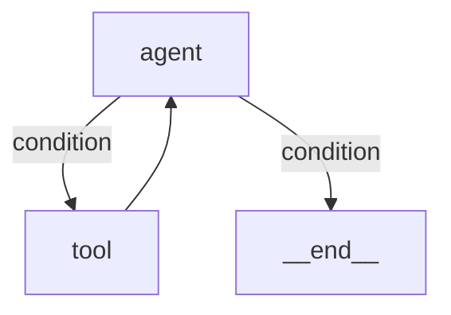

# metalcraft

A LangGraph-style stateful graph orchestrator for AI agents in Rust.

Build complex, stateful agentic workflows with typed state, cyclic graphs, human-in-the-loop interrupts, parallel execution, and streaming — all with compile-time safety guarantees.

## Features

- **Typed state management** — Define state and mutations via the `Reducer` trait. Every state transition is an explicit, compile-time-checked enum variant.
- **Flexible graph routing** — Static edges, conditional branching, and parallel fan-out/merge.
- **Cyclic graphs** — Agent loops that run until a condition is met, not just DAGs.
- **Human-in-the-loop** — Interrupt execution, checkpoint state, resume later with injected updates.
- **Checkpointing** — Pluggable persistence via the `Checkpointer` trait. Ships with `MemoryCheckpointer`.
- **Async streaming** — Stream step-by-step execution events in real time.
- **Tool registry** — Define tools once, export to Anthropic or OpenAI format.
- **LLM integration** — Optional [Rig](https://docs.rig.rs) support for provider-agnostic model access.
- **Visualization** — Export any graph as a Mermaid flowchart.

## Quickstart

Add to your `Cargo.toml`:

```toml
[dependencies]
metalcraft = "0.1"
async-trait = "0.1"
tokio = { version = "1", features = ["full"] }
```

### Define state and reducer

```rust
use metalcraft::*;
use async_trait::async_trait;

#[derive(Clone, Debug)]
struct AgentState {
    messages: Vec<String>,
    tool_calls: u32,
}

enum Update {
    AddMessage(String),
    IncToolCalls,
}

impl Reducer for AgentState {
    type Update = Update;
    fn apply(&mut self, update: Update) {
        match update {
            Update::AddMessage(m) => self.messages.push(m),
            Update::IncToolCalls => self.tool_calls += 1,
        }
    }
}
```

### Define nodes

```rust
struct AgentNode;

#[async_trait]
impl Node<AgentState> for AgentNode {
    async fn run(&self, state: &AgentState) -> Result<NodeOutcome<Update>> {
        if state.tool_calls < 2 {
            Ok(NodeOutcome::Update(Update::AddMessage(
                format!("Need tool call #{}", state.tool_calls + 1),
            )))
        } else {
            Ok(NodeOutcome::Update(Update::AddMessage(
                "Final answer.".into(),
            )))
        }
    }
}

struct ToolNode;

#[async_trait]
impl Node<AgentState> for ToolNode {
    async fn run(&self, _state: &AgentState) -> Result<NodeOutcome<Update>> {
        Ok(NodeOutcome::Update(Update::IncToolCalls))
    }
}
```

### Build and run the graph

```rust
use std::sync::Arc;

#[tokio::main]
async fn main() -> std::result::Result<(), Box<dyn std::error::Error>> {
    let graph = Graph::<AgentState>::new()
        .add_node("agent", AgentNode)
        .add_node("tool", ToolNode)
        .add_conditional("agent", |state: &AgentState| {
            if state.messages.last().map_or(false, |m| m.contains("Final")) {
                END.to_string()
            } else {
                "tool".to_string()
            }
        })
        .add_edge("tool", "agent")
        .set_entry("agent")
        .compile()?;

    // Print the graph as Mermaid
    println!("{}", graph.to_mermaid());

    let executor = Executor::new(graph)
        .with_checkpointer(Arc::new(MemoryCheckpointer::new()));

    let outcome = executor.run(
        AgentState { messages: vec![], tool_calls: 0 },
        "thread-1",
    ).await?;

    match outcome {
        RunOutcome::Completed(state) => println!("Done: {:?}", state),
        RunOutcome::Interrupted { reason, .. } => println!("Paused: {reason}"),
    }

    Ok(())
}
```

This produces the graph:



## Human-in-the-Loop

Nodes can interrupt execution for human review:

```rust
struct ReviewNode;

#[async_trait]
impl Node<ReviewState> for ReviewNode {
    async fn run(&self, state: &ReviewState) -> Result<NodeOutcome<Update>> {
        if state.approved {
            Ok(NodeOutcome::Update(Update::Approve))
        } else {
            Ok(NodeOutcome::interrupt("Please review this draft"))
        }
    }
}
```

State is checkpointed at the interrupt. Resume later with an injected update:

```rust
let outcome = executor.resume("thread-1", Some(Update::Approve)).await?;
```

## Parallel Execution

Fan out to multiple nodes and merge results:

```rust
let graph = Graph::<MyState>::new()
    .add_node("plan", PlanNode)
    .add_node("research", ResearchNode)
    .add_node("code", CodeNode)
    .add_node("merge", MergeNode)
    .add_parallel("plan", vec!["research", "code"])
    .add_edge("research", "merge")
    .add_edge("code", "merge")
    .add_edge("merge", END)
    .set_entry("plan")
    .compile()?;
```

## Streaming

Stream execution events in real time:

```rust
use futures::StreamExt;

let executor = Arc::new(executor);
let mut stream = executor.stream(initial_state, "thread-1".into());

while let Some(Ok((event, state))) = stream.next().await {
    println!("Node: {} -> Next: {}", event.node, event.next);
}
```

## Tool Registry

Define tools and export to LLM provider formats:

```rust
use metalcraft::tools::{Tool, ToolRegistry};

struct WeatherTool;

#[async_trait]
impl Tool for WeatherTool {
    fn name(&self) -> &str { "get_weather" }
    fn description(&self) -> &str { "Get weather for a city" }
    fn parameters_schema(&self) -> serde_json::Value {
        serde_json::json!({
            "type": "object",
            "properties": { "city": { "type": "string" } },
            "required": ["city"]
        })
    }
    async fn call(&self, args: serde_json::Value) -> anyhow::Result<serde_json::Value> {
        let city = args["city"].as_str().unwrap_or("unknown");
        Ok(serde_json::json!({ "temp": "72°F", "city": city }))
    }
}

let registry = ToolRegistry::new().register(WeatherTool);
let anthropic_tools = registry.to_anthropic_tools();
let openai_tools = registry.to_openai_tools();
let result = registry.call("get_weather", serde_json::json!({"city": "NYC"})).await?;
```

## LLM Integration (Rig)

Enable the `rig` feature for provider-agnostic LLM access:

```toml
[dependencies]
metalcraft = { version = "0.1", features = ["rig"] }
```

See [`examples/rig_agent.rs`](examples/rig_agent.rs) for a full LLM-powered agent with tool calling.

## Examples

| Example | Description |
|---------|-------------|
| [`agent_loop`](examples/agent_loop.rs) | Classic agent loop: agent calls tools until done |
| [`human_in_the_loop`](examples/human_in_the_loop.rs) | Draft, review with interrupt, resume with approval |
| [`rig_agent`](examples/rig_agent.rs) | LLM-powered agent using Rig (OpenAI/Anthropic) |
| [`spice_test`](examples/spice_test.rs) | Behavioral testing with Spice framework |
| [`spice_llm_test`](examples/spice_llm_test.rs) | LLM agent + Spice declarative tests |

Run an example:

```bash
cargo run --example agent_loop
```

## Architecture

```
┌─────────────────────────────────────────────────┐
│                   Executor                       │
│  run() / resume() / stream()                     │
│                                                  │
│  ┌───────────────────────────────────────────┐   │
│  │            CompiledGraph                   │   │
│  │                                            │   │
│  │  ┌──────┐    ┌──────┐    ┌──────┐         │   │
│  │  │ Node │───→│ Node │───→│ Node │──→ END  │   │
│  │  └──────┘    └──────┘    └──────┘         │   │
│  │       ↑          │                         │   │
│  │       └──────────┘  (cycle)                │   │
│  │                                            │   │
│  │  Edges: Static | Conditional | Parallel    │   │
│  └───────────────────────────────────────────┘   │
│                                                  │
│  ┌──────────────┐    ┌───────────────────┐       │
│  │ Checkpointer │    │   ToolRegistry    │       │
│  │ save / load  │    │ call / export     │       │
│  └──────────────┘    └───────────────────┘       │
└─────────────────────────────────────────────────┘

State: Reducer trait + typed Update enum
```

## Roadmap

See [ROADMAP.md](ROADMAP.md) for a detailed gap analysis against LangGraph and prioritized feature plan.

## License

MIT
